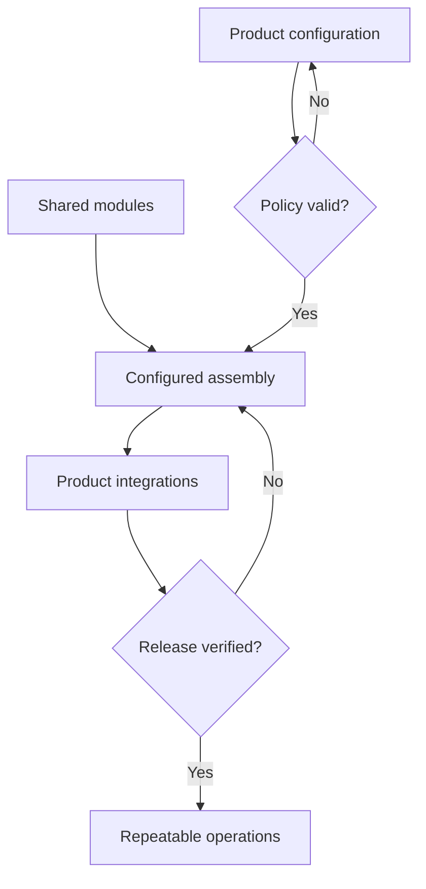

[← All systems](https://github.com/J0UH) · [Product engineering](https://github.com/J0UH/product-engineering)

  

# RYZE Furnace

RYZE Furnace explored how to assemble repeatable digital-asset products from shared components without turning every launch into a new codebase.

## The engineering problem

Reuse becomes dangerous when configuration silently changes financial behaviour. The system needed composable product surfaces with explicit policy, integration, and release boundaries.

## What the system covers

- Configurable product composition
- Shared interface and service modules
- Environment and integration setup
- Product-specific policy boundaries
- Repeatable release and operating workflows

## System shape

## Build notes

- Keep product policy visible in configuration reviews.
- Reuse infrastructure without hiding different operating risks.
- Make each assembled product traceable to component versions.

Public overview only. Source code, customer data, credentials, and private operating details are not included.

## Talk through a similar problem

Working on something similar? [Tell me about it](mailto:ju@jomena.group?subject=RYZE%20Furnace).
