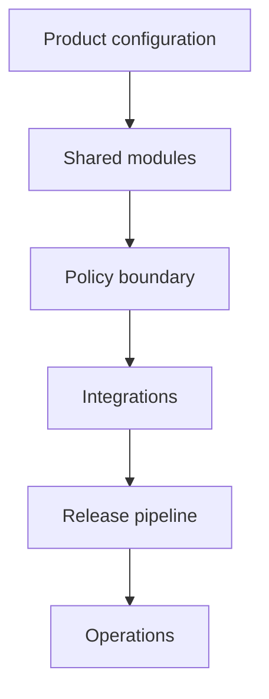

  

# RYZE Furnace

RYZE Furnace explored how to assemble repeatable digital-asset products from shared components without turning every launch into a new codebase.

[Discuss a similar system](mailto:ju@jomena.group?subject=Discuss%20RYZE%20Furnace) | [Book a technical call](mailto:ju@jomena.group?subject=Book%20a%20technical%20call%20about%20RYZE%20Furnace)

## The engineering problem

Reuse becomes dangerous when configuration silently changes financial behaviour. The system needed composable product surfaces with explicit policy, integration, and release boundaries.

## What the system covers

- Configurable product composition
- Shared interface and service modules
- Environment and integration setup
- Product-specific policy boundaries
- Repeatable release and operating workflows

## System shape

## Build notes

- Keep product policy visible in configuration reviews.
- Reuse infrastructure without hiding different operating risks.
- Make each assembled product traceable to component versions.

Built under the Aryze umbrella. The underlying source and company IP remain private and owned by Aryze. Delivery involved people across engineering, product, operations, compliance, and design. Open-source foundations retain their original attribution and licences.

## Talk through a similar problem

If you are trying to build, untangle, or ship a system in this area, [send me a note](mailto:ju@jomena.group?subject=I%20need%20help%20with%20RYZE%20Furnace). If the problem needs a deeper technical conversation, [book a call by email](mailto:ju@jomena.group?subject=Book%20a%20technical%20call%20about%20RYZE%20Furnace).
